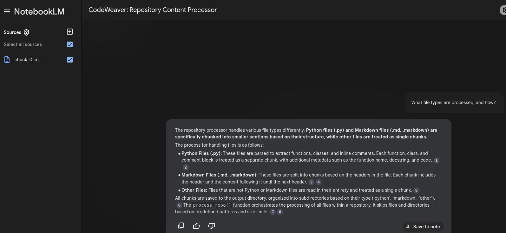

# pyragify: Unlock the Power of Your Code with NotebookLM  

**pyragify** is a Python-based tool designed to **transform your Python code repositories into a format that's ready for analysis with large language models (LLMs), specifically NotebookLM.** It breaks down complex code structures into manageable semantic chunks, making it easier to understand, analyze, and extract insights from your code.

## Why pyragify?

* **Boost Code Comprehension:**  pyragify makes it easier to digest large codebases by dividing them into smaller, logical units.
* **Effortless Analysis:** The structured output simplifies the process of analyzing code, identifying patterns, and extracting knowledge.
* **Unlock the Power of NotebookLM:** pyragify prepares your code for use with NotebookLM, allowing you to leverage the power of LLMs for tasks like code summarization, documentation generation, and question answering.

## Key Features

* **Semantic Chunking:** pyragify intelligently extracts functions, classes, and comments from Python files, as well as headers and sections from Markdown files, preserving the context and meaning.
* **Wide Format Support:** It handles Python (.py), Markdown (.md, .markdown), HTML (.html), CSS (.css), and other common file types, ensuring all your repository content is processed.
* **Smart Parsing:** Uses AST for Python files, regex-based parsing for HTML/CSS, and header-based chunking for Markdown files.
* **Seamless Integration with NotebookLM:** The output format is specifically designed for compatibility with NotebookLM, making it easy to analyze your code with powerful LLMs.
* **Flexible Configuration:** Tailor the processing through a YAML file or command-line arguments to fit your specific needs.
* **File Skipping:** Respect your `.gitignore` and `.dockerignore` files, and define custom skip patterns for even more control.
* **Word Limit Control:** Automatically chunks output files based on a configurable word limit to ensure manageable file sizes.
* **Input Validation:** Validates repository paths and provides clear error messages for invalid inputs.

## Getting Started

### Installation

1. **Using uv (Recommended):**

    ```bash
    uv pip install pyragify
    ```

    `uv` is a blazing fast Python package manager that handles virtual environments and dependencies automatically.

2. **Using pip:**

    ```bash
    pip install pyragify
    ```

3. **From Source:**

    ```bash
    git clone https://github.com/ThomasBury/pyragify.git
    cd pyragify
    uv pip install -e .
    ```

### Usage

1. **Best Practice with uv:**

    ```bash
    uv run pyragify --config-file config.yaml
    ```

See below for details about the configuration file.

2. **Direct CLI Execution:**

    ```bash
    python -m pyragify --config-file config.yaml
    ```

#### Arguments and Options

See `pyragify --help` for a full list of options.

* `--config-file`: Path to the YAML configuration file (default: config.yaml).
* `--repo-path`: Override the repository path.
* `--output-dir`: Override the output directory.
* `--max-words`: Override the maximum words per output file.
* `--max-file-size`: Override the maximum file size (in bytes) to process.
* `--skip-patterns`: Override file patterns to skip.
* `--skip-dirs`: Override directories to skip.
* `--verbose`: Enable detailed logging for debugging.

### Configuration (config.yaml)

```yaml
repo_path: /path/to/repository
output_dir: /path/to/output
max_words: 200000
max_file_size: 10485760 # 10 MB
skip_patterns:
 - "*.log"
 - "*.tmp"
skip_dirs:
 - "__pycache__"
 - "node_modules"
verbose: false
```

## Example Workflow

1. **Prepare Your Repository:** Make sure your repository contains the code you want to process. Utilize `.gitignore` or `.dockerignore` to exclude unwanted files or directories.
2. **Configure pyragify:** Create a `config.yaml` file with your desired settings or use the default configuration.
3. **Process the Repository:** Run pyragify using uv (recommended):

    ```bash
    uv run pyragify --config-file config.yaml
    ```

4. **Check the Output:** Your processed content is neatly organized by file type in the specified output directory.

## Chat with Your Codebase (with NotebookLM)

1. Navigate to NotebookLM.
2. Upload the `chunk_0.txt` file (or other relevant chunks) from the pyragify output directory to a new notebook.
3. Start asking questions and get insights with precise citations! You can even generate a podcast from your code.
    

## Output Structure

The processed content is saved as `.txt` files and categorized into subdirectories based on the file type:

* `python/`:  Contains chunks of Python functions, classes, and their code.
* `markdown/`:  Contains sections of Markdown files split by headers.
* `html/`:  Contains HTML script and style chunks extracted from HTML files.
* `css/`:  Contains CSS rule chunks from CSS files.
* `other/`:  Contains plain-text versions of unsupported file types.

## Advanced Features

* **Input Validation:** Validates repository paths and provides clear error messages for invalid inputs.
* **Respect for Ignore Files:** pyragify automatically honors `.gitignore` and `.dockerignore` patterns.
* **Incremental Processing:** MD5 hashes are used to efficiently skip unchanged files during subsequent runs.

## Contributing

We welcome contributions! To contribute to pyragify:

1. Clone the repository.
2. Install dependencies.
3. Run tests. (Test suite is under development).

## Support

Feel free to create a GitHub issue for any questions, bug reports, or feature requests.

## License

This project is licensed under the MIT License. See the [LICENSE](LICENSE) file for details.

## Example Usages

**Process a Repository with Default Settings:**

```bash
uv run pyragify --config-file config.yaml
```

**Process a Specific Repository with Custom Settings:**

```bash
uv run pyragify \
 --repo-path /my/repo \
 --output-dir /my/output \
 --max-words 100000 \
 --max-file-size 5242880 \
 --skip-patterns "*.log,*.tmp" \
 --skip-dirs "__pycache__,node_modules" \
 --verbose
```
