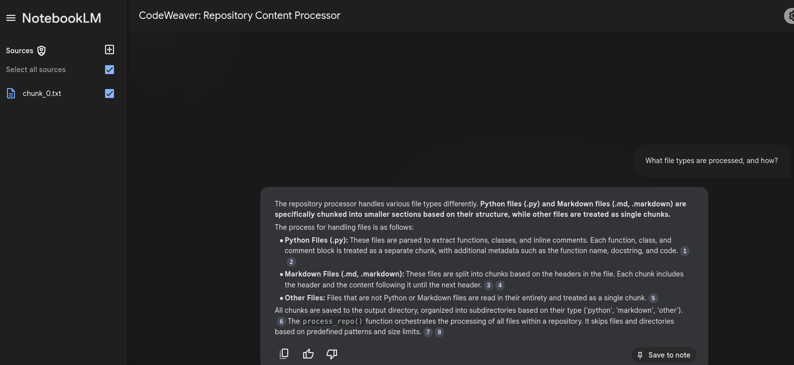

# Pyragify

Pyragify turns a code repository into plain-text chunks that are easier to load into NotebookLM and other LLM tools. It extracts semantic units from source files, writes `.txt` output grouped by file type, and stores metadata for incremental re-runs.

## What It Does

- Chunks Python code into functions, classes, and comments
- Splits Markdown files by header sections
- Processes common repository files into LLM-friendly text output
- Respects `.gitignore` and `.dockerignore` patterns
- Tracks file hashes so unchanged files can be skipped on later runs

## Supported Inputs

Pyragify has dedicated handling for:

- Python: `.py`
- Markdown: `.md`, `.markdown`
- HTML: `.html`
- CSS: `.css`
- Other common repository files are included as plain text when they can be read as UTF-8

## Installation

### Install From PyPI

```bash
uv pip install pyragify
```

or

```bash
pip install pyragify
```

### Install From Source

```bash
git clone https://github.com/ThomasBury/pyragify.git
cd pyragify
uv sync --group dev
```

## Quick Start

### Run With A Config File

The default entrypoint is `pyragify`.

```bash
uv run pyragify --config-file config.yaml
```

You can also run it as a module:

```bash
python -m pyragify --config-file config.yaml
```

### Run Without A Config File

If you do not use `config.yaml`, pass every setting you want to rely on directly on the command line.

```bash
uv run pyragify \
  --repo-path /path/to/repository \
  --output-dir /path/to/output \
  --max-words 200000 \
  --max-file-size 10485760 \
  --skip-patterns "*.log" \
  --skip-patterns "*.tmp" \
  --skip-dirs "__pycache__" \
  --skip-dirs "node_modules" \
  --verbose
```

## CLI Notes

- Use `pyragify --help` for the full option list
- Command-line options override values loaded from `config.yaml`
- Repeat `--skip-patterns` once per pattern
- Repeat `--skip-dirs` once per directory name

## Configuration

Example `config.yaml`:

```yaml
repo_path: /path/to/repository
output_dir: /path/to/output
max_words: 200000
max_file_size: 10485760  # 10 MB
skip_patterns:
  - "*.log"
  - "*.tmp"
skip_dirs:
  - "__pycache__"
  - "node_modules"
verbose: false
```

## Example Workflow

1. Point `repo_path` at the repository you want to process.
2. Choose an `output_dir` where generated chunks and metadata should be written.
3. Run `uv run pyragify --config-file config.yaml` or pass the same settings on the command line.
4. Open the generated files in `output/`, especially `output/remaining/chunk_0.txt`, in NotebookLM or another LLM workflow.

## Output Structure

The generated output is grouped by content type:

- `python/`: Python functions, classes, and comment chunks
- `markdown/`: Markdown sections split by headers
- `html/`: HTML script and style chunks
- `css/`: CSS rule chunks
- `other/`: Readable files that do not have a dedicated parser
- `remaining/`: Overflow chunks once grouped outputs reach the word limit
- `metadata.json`: Summary of processed files
- `hashes.json`: MD5 hashes used for incremental processing

## NotebookLM Workflow

1. Run Pyragify on the repository you care about.
2. Upload one or more generated `.txt` chunks to a NotebookLM notebook.
3. Ask questions about the codebase and use the generated citations to trace answers back to the source text.



## Development

Set up the local environment:

```bash
uv sync --group dev
```

Run the test suite:

```bash
uv run pytest
```

Run a focused test slice while iterating:

```bash
uv run pytest tests/test_processor.py -k markdown
```

## Contributing

Contributions are welcome. Open an issue for bugs or feature requests, then send a pull request with focused changes and matching tests.

## License

This project is licensed under the MIT License. See [LICENSE](LICENSE).
