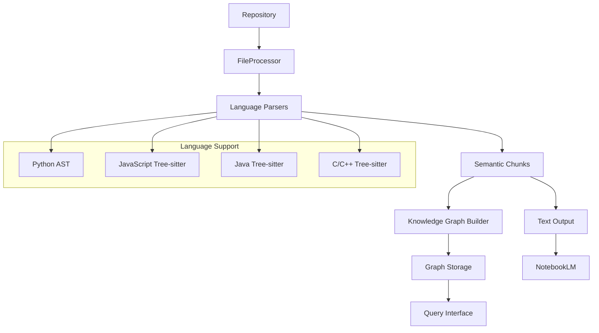

# Welcome to Pyragify

<div style="text-align: center; margin: 2rem 0;">
  
  <p style="font-style: italic; color: #666; margin-top: 0.5rem;">Chat with your codebase using NotebookLM</p>
</div>

**Pyragify** is a powerful Python-based tool that transforms your code repositories into LLM-ready context. It intelligently processes multiple programming languages, extracting semantic relationships and breaking down complex codebases into manageable chunks optimized for analysis with large language models like NotebookLM.

## 🚀 Key Features

<div class="grid cards" markdown>

- **:material-code-braces: Multi-Language Support**
  <br>
  Process Python, JavaScript, TypeScript, Java, C/C++, and more with language-specific parsing

- **:material-graph: Knowledge Graph**
  <br>
  Build comprehensive knowledge graphs capturing code relationships, imports, function calls, and inheritance

- **:material-magnify: Intelligent Chunking**
  <br>
  Semantic chunking that preserves context and relationships for better LLM analysis

- **:material-notebook: NotebookLM Ready**
  <br>
  Output format specifically designed for seamless integration with NotebookLM

- **:material-tune: Flexible Configuration**
  <br>
  Highly configurable processing with YAML config files and command-line options

- **:material-speedometer: Performance Optimized**
  <br>
  Efficient processing with incremental updates and parallel execution

</div>

## 📋 Quick Start

=== "Installation"

    Install Pyragify using your preferred method:

    ```bash
    # Using uv (recommended)
    uv pip install pyragify

    # Using pip
    pip install pyragify

    # From source
    git clone https://github.com/ThomasBury/pyragify.git
    cd pyragify
    uv pip install -e .
    ```

=== "Basic Usage"

    Process your repository with default settings:

    ```bash
    # Using uv
    uv run pyragify process-repo --config-file config.yaml

    # Direct execution
    python -m pyragify process-repo --config-file config.yaml
    ```

=== "Configuration"

    Create a `config.yaml` file:

    ```yaml
    repo_path: /path/to/your/repository
    output_dir: ./output
    max_words: 200000
    max_file_size: 10485760  # 10 MB

    # Enable knowledge graph features
    graph:
      enabled: true
      output_dir: "./graphs"
      format: "json"
      relationships:
        - "imports"
        - "calls"
        - "inherits"
        - "references"
    ```

## 🎯 What Makes Pyragify Special?

### Intelligent Code Understanding

Pyragify doesn't just split files arbitrarily—it understands the semantic structure of your code:

- **Python**: AST-based parsing extracts functions, classes, and their relationships
- **JavaScript/TypeScript**: Tree-sitter powered analysis of modern JavaScript features
- **Java/C/C++**: Comprehensive parsing of object-oriented and procedural code
- **Markdown**: Header-based sectioning preserves document structure

### Knowledge Graph Integration

Beyond simple chunking, Pyragify builds a **knowledge graph** that captures:

- Import relationships between modules
- Function call hierarchies
- Class inheritance chains
- Cross-file references
- Dependency networks

### Query Your Codebase

Use the built-in query interface to explore your codebase:

```bash
# Find related context for a function
pyragify query-graph --command related --entity "src/main.py::process_data"

# Get call hierarchy
pyragify query-graph --command hierarchy --entity "calculate_total"

# Search by pattern
pyragify query-graph --command search --pattern "function.*error"
```

## 📊 Use Cases

<div class="grid cards" markdown>

- **:material-book-open: Documentation Generation**
  <br>
  Generate comprehensive documentation from code analysis

- **:material-chat: Code Chat**
  <br>
  Enable natural language queries about your codebase with NotebookLM

- **:material-magnify: Code Review**
  <br>
  Understand complex codebases quickly for review and onboarding

- **:material-code-json: API Analysis**
  <br>
  Analyze API structures and relationships across services

- **:material-school: Learning & Teaching**
  <br>
  Study code patterns and architectural decisions

- **:material-bug: Debugging**
  <br>
  Find related code when investigating issues

</div>

## 🏗️ Architecture Overview



## 📈 Performance & Scalability

- **Incremental Processing**: Only processes changed files using MD5 hashing
- **Parallel Execution**: Multi-threaded processing for large repositories
- **Memory Efficient**: Streaming processing for large files
- **Configurable Limits**: Control file sizes and output chunk sizes
- **Smart Filtering**: Respects `.gitignore` and custom skip patterns

## 🤝 Contributing

We welcome contributions! Whether you're fixing bugs, adding features, or improving documentation:

1. Fork the repository
2. Create a feature branch
3. Make your changes
4. Add tests if applicable
5. Submit a pull request

See our [Contributing Guide](contributing.md) for detailed instructions.

## 📄 License

This project is licensed under the MIT License - see the [LICENSE](../LICENSE) file for details.

---

<div style="text-align: center; margin-top: 2rem;">
  <a href="getting-started/installation/" class="md-button md-button--primary">Get Started</a>
  <a href="user-guide/basic-usage/" class="md-button">User Guide</a>
  <a href="https://github.com/ThomasBury/pyragify" class="md-button">GitHub</a>
</div>
