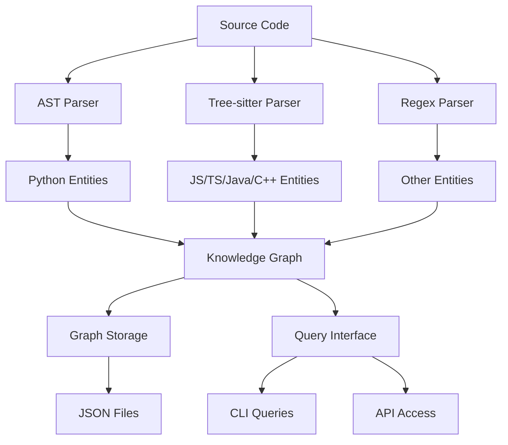

# Knowledge Graph

Pyragify's knowledge graph feature captures and analyzes relationships between code entities, enabling powerful queries and deeper code understanding.

## Overview

The knowledge graph represents your codebase as a network of interconnected entities:

- **Nodes**: Code entities (files, functions, classes, modules)
- **Edges**: Relationships between entities (imports, calls, inheritance)

This graph enables:

- Finding related code across files
- Understanding call hierarchies
- Analyzing dependencies
- Pattern-based searches
- Cross-file reference resolution

## Architecture



## Node Types

### File Nodes
```json
{
  "id": "file::src/main.py",
  "type": "file",
  "file": "src/main.py",
  "name": "main.py",
  "language": "python",
  "metadata": {
    "size": 2048
  }
}
```

### Function Nodes
```json
{
  "id": "src/main.py::calculate_total",
  "type": "function",
  "file": "src/main.py",
  "name": "calculate_total",
  "line_start": 10,
  "line_end": 25,
  "language": "python",
  "metadata": {
    "docstring": "Calculate total price",
    "parameters": ["items", "tax_rate"],
    "return_type": "float"
  }
}
```

### Class Nodes
```json
{
  "id": "src/main.py::ShoppingCart",
  "type": "class",
  "file": "src/main.py",
  "name": "ShoppingCart",
  "line_start": 30,
  "line_end": 60,
  "language": "python",
  "metadata": {
    "docstring": "Shopping cart class",
    "methods": ["add_item", "get_total"]
  }
}
```

### Module Nodes
```json
{
  "id": "module::os.path",
  "type": "module",
  "name": "os.path",
  "language": "python"
}
```

## Edge Types

### Import Relationships
```json
{
  "source": "file::src/main.py",
  "target": "module::os",
  "type": "imports",
  "metadata": {
    "line": 1,
    "alias": null
  }
}
```

### Function Calls
```json
{
  "source": "src/main.py::process_data",
  "target": "src/utils.py::validate_input",
  "type": "calls",
  "metadata": {
    "line": 15
  }
}
```

### Inheritance
```json
{
  "source": "src/main.py::PremiumCart",
  "target": "src/main.py::ShoppingCart",
  "type": "inherits",
  "metadata": {
    "line": 100
  }
}
```

### Containment
```json
{
  "source": "file::src/main.py",
  "target": "src/main.py::calculate_total",
  "type": "contains",
  "metadata": {
    "line_start": 10,
    "line_end": 25
  }
}
```

## Query Interface

### Finding Related Context

Find all entities related to a specific function or class:

```bash
pyragify query-graph --command related --entity "src/main.py::calculate_total"
```

**Parameters:**
- `entity`: Entity ID (format: `file.py::entity_name`)
- `depth`: Traversal depth (default: 2)

**Example Output:**
```json
{
  "entity": "src/main.py::calculate_total",
  "results": [
    {
      "node": {
        "id": "file::src/main.py",
        "type": "file",
        "name": "main.py"
      },
      "relevance_score": 0.5,
      "relationship_path": ["contains"]
    },
    {
      "node": {
        "id": "src/main.py::ShoppingCart",
        "type": "class",
        "name": "ShoppingCart"
      },
      "relevance_score": 0.33,
      "relationship_path": ["contains", "contains"]
    }
  ]
}
```

### Call Hierarchy Analysis

Understand function call relationships:

```bash
pyragify query-graph --command hierarchy --entity "calculate_total"
```

**Example Output:**
```json
{
  "function": "calculate_total",
  "callers": [
    {
      "name": "get_total",
      "file": "src/main.py",
      "line": 25
    },
    {
      "name": "checkout",
      "file": "src/cart.py",
      "line": 45
    }
  ],
  "callees": [
    {
      "name": "sum",
      "line": 12
    },
    {
      "name": "apply_discount",
      "line": 18
    }
  ],
  "locations": [
    {
      "file": "src/main.py",
      "line": 10
    }
  ]
}
```

### Dependency Analysis

Find all files that a given file depends on:

```bash
pyragify query-graph --command dependencies --entity "src/main.py"
```

**Example Output:**
```json
{
  "file": "src/main.py",
  "dependencies": [
    "src/utils.py",
    "src/models.py",
    "src/config.py"
  ]
}
```

### Pattern Search

Search for entities matching regex patterns:

```bash
pyragify query-graph --command search --pattern "test.*function"
```

**Example Output:**
```json
{
  "pattern": "test.*function",
  "results": [
    {
      "id": "tests/test_main.py::test_calculate_function",
      "type": "function",
      "name": "test_calculate_function",
      "file": "tests/test_main.py"
    }
  ]
}
```

## Advanced Queries

### Multi-hop Analysis

Find entities connected through multiple relationships:

```bash
# Find entities 3 levels deep
pyragify query-graph --command related --entity "src/main.py::User" --depth 3
```

### Cross-file References

The graph automatically resolves references between files:

```bash
# Find all files that reference a specific function
pyragify query-graph --command related --entity "src/utils.py::validate_email"
```

### Relationship Filtering

Focus on specific relationship types:

```yaml
# In config.yaml
graph:
  enabled: true
  relationships:
    - "imports"    # Only import relationships
    - "calls"      # Only function calls
```

## Graph Storage

### JSON Format

Graphs are stored as JSON files with this structure:

```json
{
  "nodes": {
    "file::src/main.py": {
      "id": "file::src/main.py",
      "type": "file",
      "file": "src/main.py",
      "name": "main.py",
      "language": "python",
      "metadata": {}
    }
  },
  "edges": [
    {
      "source": "file::src/main.py",
      "target": "src/main.py::calculate_total",
      "type": "contains",
      "metadata": {
        "line_start": 10,
        "line_end": 25
      }
    }
  ],
  "metadata": {
    "version": "1.0",
    "created_at": "2024-01-15T10:30:00Z",
    "total_nodes": 94,
    "total_edges": 93,
    "languages": ["python"]
  }
}
```

### Storage Location

Graphs are saved to:
```
output/
├── graphs/
│   └── repository_graph.json
```

## Performance Considerations

### Graph Size

- **Small projects** (< 100 files): Fast queries, minimal memory usage
- **Medium projects** (100-1000 files): Moderate performance, ~50MB memory
- **Large projects** (> 1000 files): Consider compression and indexing

### Optimization Strategies

1. **Selective Relationship Extraction**
```yaml
graph:
  relationships:
    - "imports"  # Most important for dependency analysis
    - "calls"    # Essential for call hierarchies
    # Skip "references" for large codebases
```

2. **Depth Limiting**
```yaml
graph:
  max_depth: 3  # Limit query depth for performance
```

3. **Compression**
```yaml
graph:
  compression: true  # Reduce storage size
```

## Language Support

### Python (Full Support)

- AST-based parsing for accurate analysis
- Function definitions and calls
- Class definitions and inheritance
- Import statements (direct and from)
- Decorator analysis

### JavaScript/TypeScript (Tree-sitter)

- Function declarations and expressions
- Class declarations and inheritance
- Import/export statements
- Call expressions
- Arrow functions

!!! warning "Tree-sitter Compatibility"
    Currently falls back to regex parsing due to version compatibility issues between `tree-sitter` and `tree-sitter-languages` packages.

### Java (Tree-sitter)

- Method declarations and calls
- Class declarations and inheritance
- Import statements
- Package analysis

### C/C++ (Tree-sitter)

- Function definitions
- Struct/class declarations
- Include statements
- Function calls

## Integration Examples

### CI/CD Pipeline

```yaml
# .github/workflows/analyze.yml
name: Code Analysis
on: [push, pull_request]

jobs:
  analyze:
    runs-on: ubuntu-latest
    steps:
      - uses: actions/checkout@v3
      - name: Analyze with Pyragify
        run: |
          pip install pyragify
          pyragify process-repo \
            --repo-path . \
            --enable-graph \
            --verbose
      - name: Generate dependency report
        run: |
          pyragify query-graph --command dependencies --entity "src/main.py" \
            > dependency-report.json
      - name: Upload analysis
        uses: actions/upload-artifact@v3
        with:
          name: code-analysis
          path: output/
```

### Custom Analysis Scripts

```python
#!/usr/bin/env python3
"""
Custom code analysis using Pyragify graph
"""
import json
import subprocess
from pathlib import Path

def analyze_codebase(repo_path):
    """Analyze codebase and generate insights."""

    # Process repository
    subprocess.run([
        "pyragify", "process-repo",
        "--repo-path", str(repo_path),
        "--enable-graph"
    ], check=True)

    # Load graph
    with open("output/graphs/repository_graph.json") as f:
        graph_data = json.load(f)

    # Analyze function complexity
    functions = [
        node for node in graph_data["nodes"].values()
        if node["type"] == "function"
    ]

    print(f"Found {len(functions)} functions")

    # Find most connected functions
    function_connections = {}
    for edge in graph_data["edges"]:
        if edge["type"] == "calls":
            caller = edge["source"]
            callee = edge["target"]
            if caller not in function_connections:
                function_connections[caller] = []
            function_connections[caller].append(callee)

    # Report top 5 most connected functions
    sorted_functions = sorted(
        function_connections.items(),
        key=lambda x: len(x[1]),
        reverse=True
    )[:5]

    print("\nTop 5 most connected functions:")
    for func_id, connections in sorted_functions:
        func_name = func_id.split("::")[-1]
        print(f"  {func_name}: {len(connections)} connections")

if __name__ == "__main__":
    analyze_codebase(Path("./my-repo"))
```

### Documentation Generation

```python
#!/usr/bin/env python3
"""
Generate API documentation from knowledge graph
"""
import json
from pathlib import Path

def generate_api_docs():
    """Generate API documentation from graph data."""

    with open("output/graphs/repository_graph.json") as f:
        graph = json.load(f)

    # Extract public API
    public_functions = []
    public_classes = []

    for node in graph["nodes"].values():
        if node["type"] == "function":
            # Check if function is public (not starting with _)
            if not node["name"].startswith("_"):
                public_functions.append(node)
        elif node["type"] == "class":
            if not node["name"].startswith("_"):
                public_classes.append(node)

    # Generate Markdown documentation
    docs = ["# API Documentation\n"]

    docs.append("## Classes\n")
    for cls in public_classes:
        docs.append(f"### {cls['name']}")
        docs.append(f"**File:** {cls['file']}")
        if "docstring" in cls.get("metadata", {}):
            docs.append(f"**Description:** {cls['metadata']['docstring']}")
        docs.append("")

    docs.append("## Functions\n")
    for func in public_functions:
        docs.append(f"### {func['name']}")
        docs.append(f"**File:** {func['file']}")
        if "docstring" in func.get("metadata", {}):
            docs.append(f"**Description:** {func['metadata']['docstring']}")
        docs.append("")

    # Write documentation
    Path("api-docs.md").write_text("\n".join(docs))
    print("API documentation generated: api-docs.md")

if __name__ == "__main__":
    generate_api_docs()
```

## Troubleshooting

### Common Graph Issues

**Empty graph after processing:**
```bash
# Check if graph building was enabled
pyragify process-repo --enable-graph --verbose

# Verify graph file exists
ls -la output/graphs/
```

**Missing relationships:**
```bash
# Check graph statistics
pyragify query-graph --command stats

# Enable more relationship types in config
echo "graph:
  relationships: [imports, calls, inherits, references]" >> config.yaml
```

**Slow queries on large graphs:**
```yaml
# Optimize graph configuration
graph:
  max_depth: 2
  compression: true
  relationships:
    - "imports"
    - "calls"
```

### Graph Validation

Pyragify automatically validates graphs during processing:

```bash
# Check validation results in logs
pyragify process-repo --enable-graph --verbose

# Manual validation
pyragify query-graph --command stats
```

### Performance Tuning

For large codebases:

1. **Limit relationship types**
2. **Reduce query depth**
3. **Enable compression**
4. **Use incremental processing**

```yaml
graph:
  enabled: true
  max_depth: 2
  compression: true
  relationships:
    - "imports"
    - "calls"
```

## Future Enhancements

### Implemented Features

- **Graph validation and repair**: Automatic integrity checking and issue resolution
- **Cross-file reference resolution**: Analysis of relationships between different files
- **Advanced query patterns**: Regex-based entity search and pattern matching
- **Graph statistics**: Comprehensive analysis of graph structure and content
- **Incremental graph building**: Efficient updates for changed files

### Planned Features

- **Graph visualization** with interactive web interface
- **Advanced query language** for complex analysis
- **Graph diffing** for comparing code changes
- **Integration with IDEs** for real-time analysis
- **Machine learning** for code pattern recognition

### Contributing

Help improve the knowledge graph:

1. **Report issues** with graph accuracy
2. **Suggest new relationship types**
3. **Contribute parsers** for additional languages
4. **Optimize algorithms** for better performance

The knowledge graph is a powerful foundation for understanding code relationships. As Pyragify evolves, the graph capabilities will expand to provide even deeper insights into your codebase.